# Summary 

This example has been developed by DataSeers (http://DataSeers.ai)

# Prerequisites 

1)  Please follow the prerequisites of the parent project
		

**taxiData_Examples.ecl**

You can run this file independently and you will find comments on what each task does.
The idea behind this is to provided illustration on how to use some basic ecl functions

In addition, the following slides provides an overview of the included functionality: 

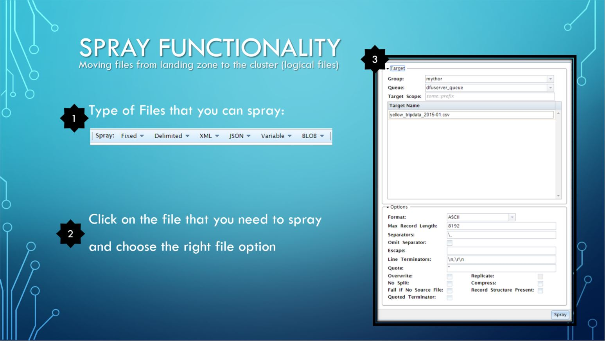

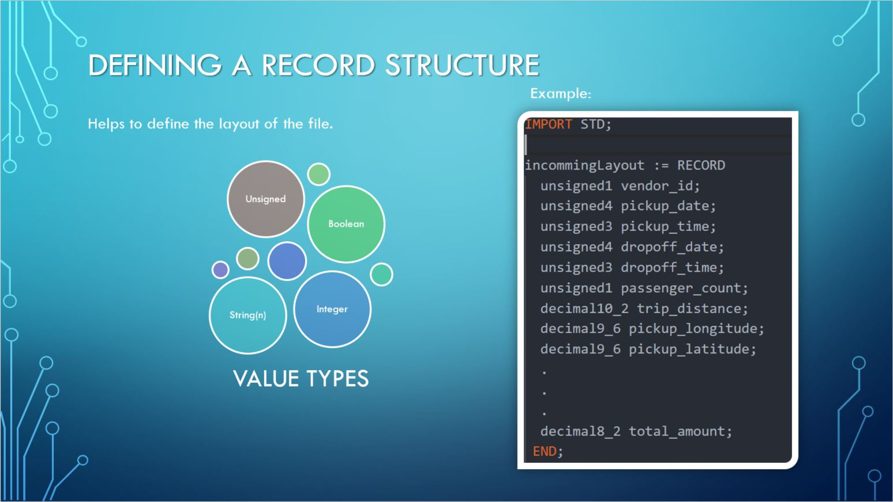

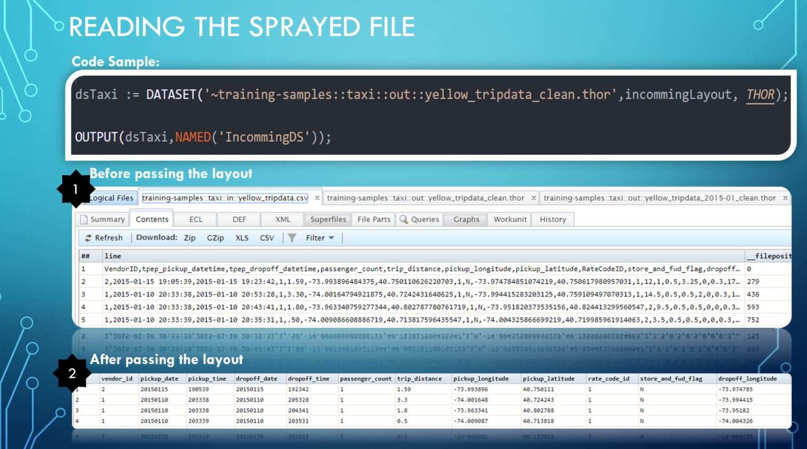

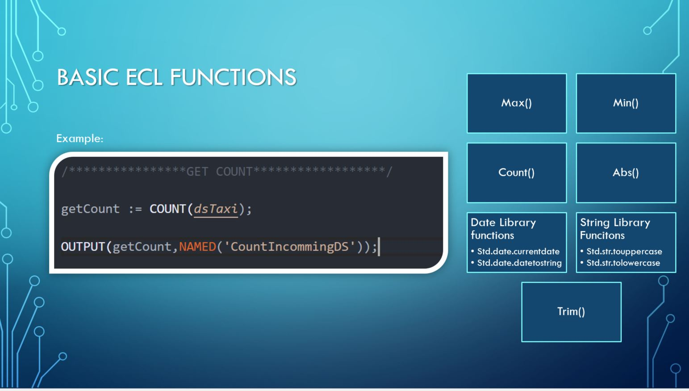

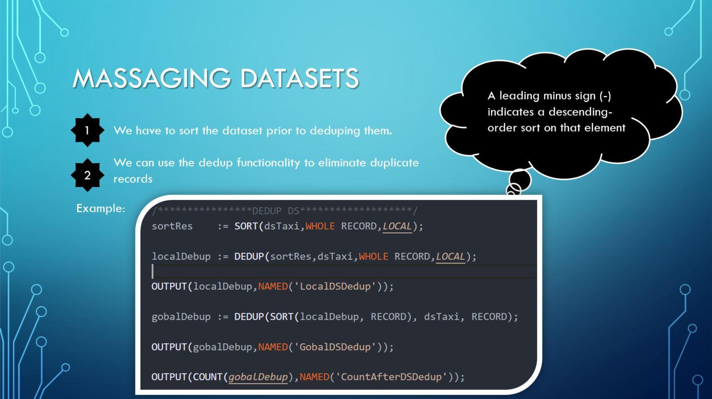

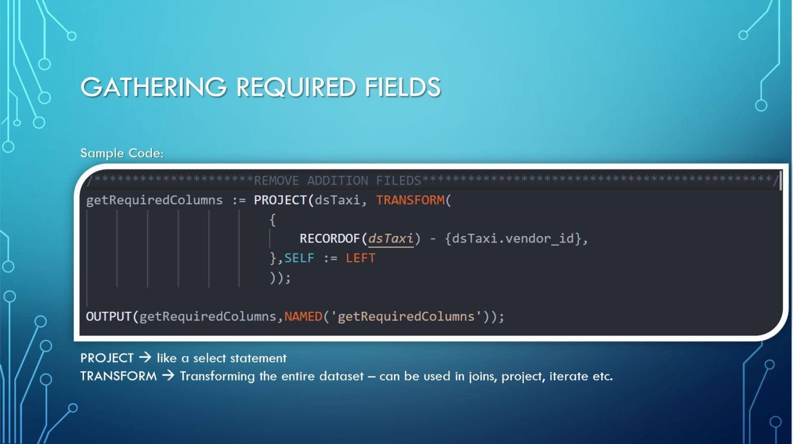

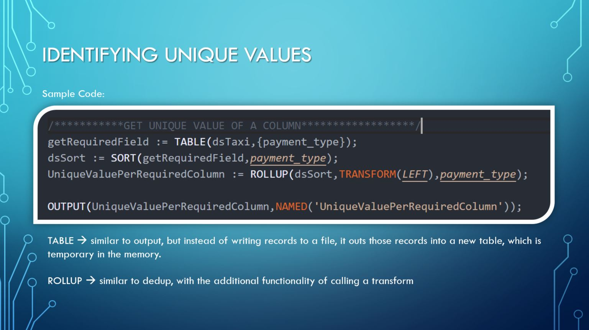

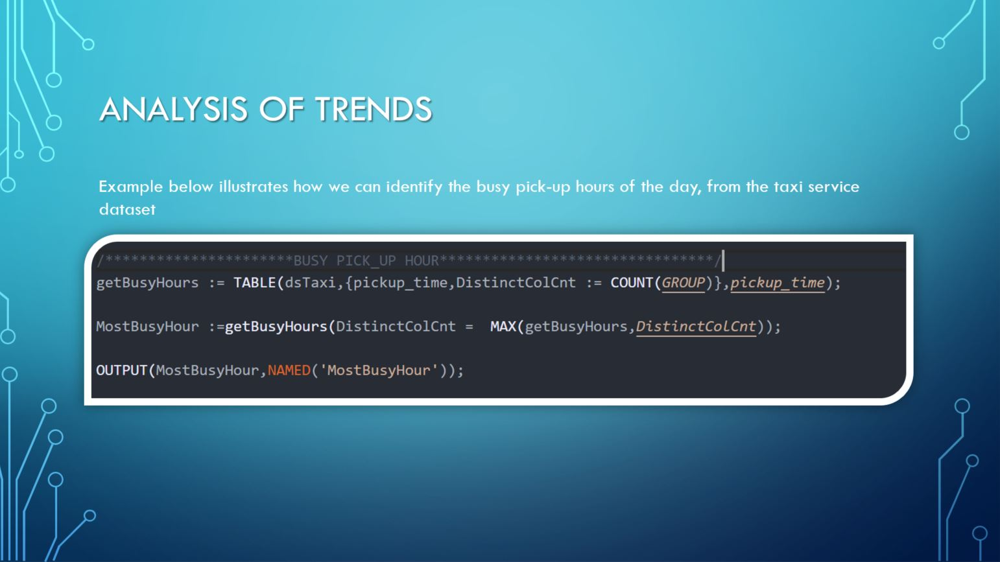

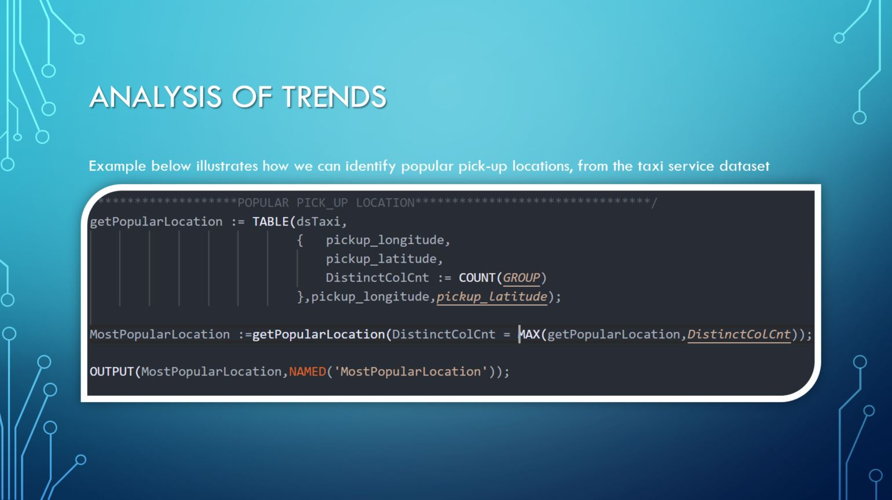

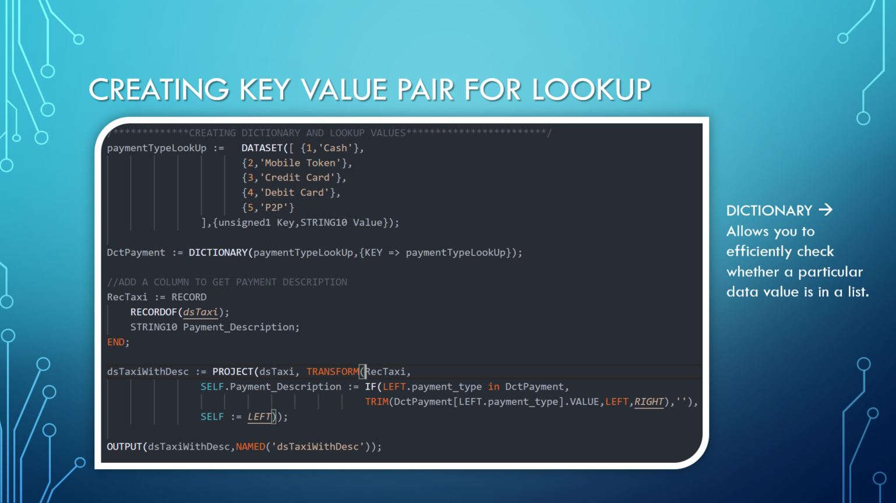

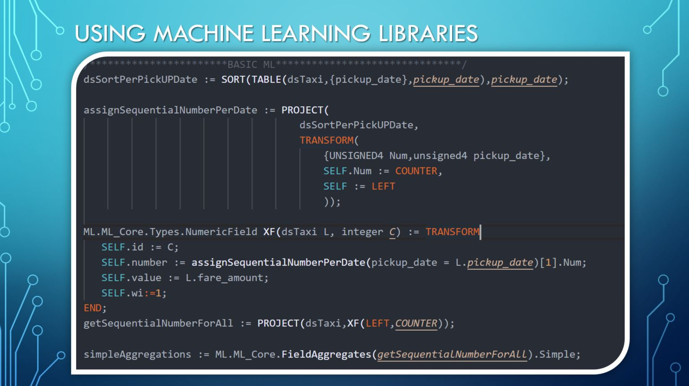

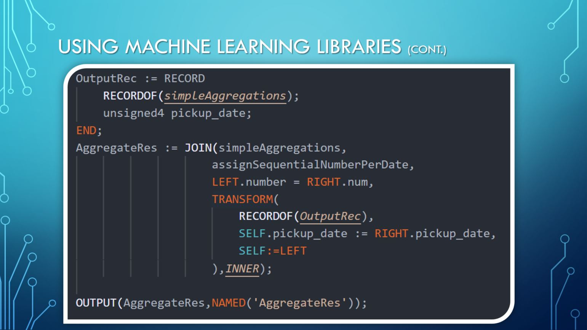

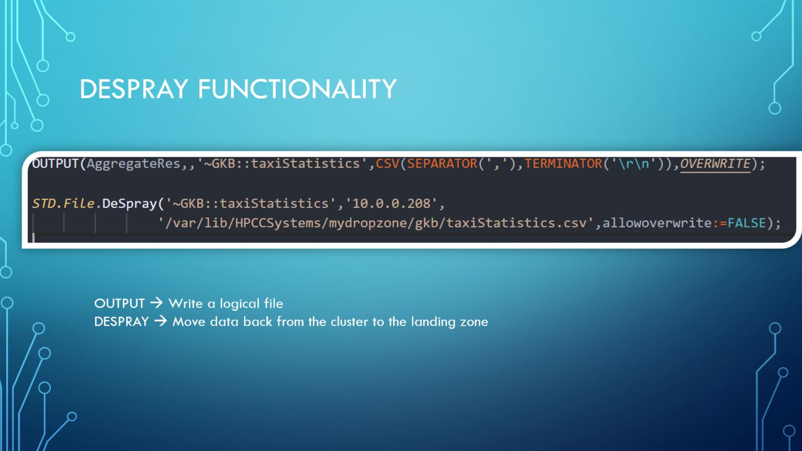
