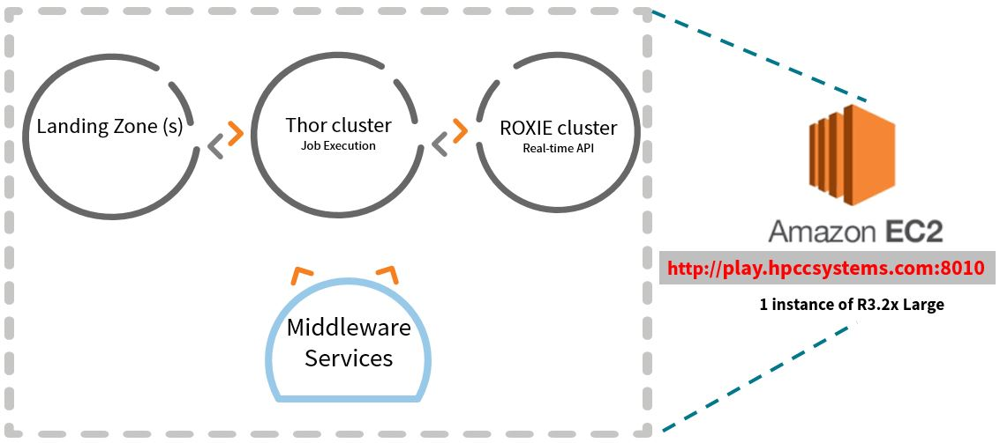
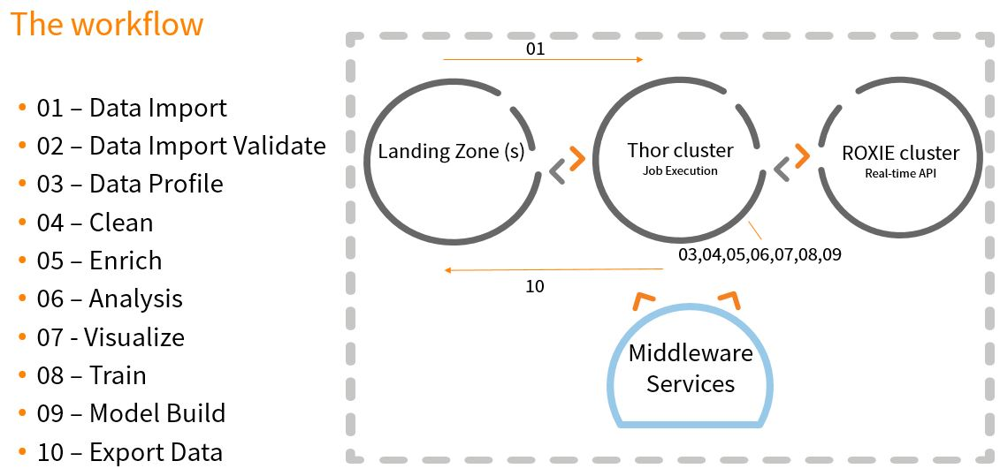
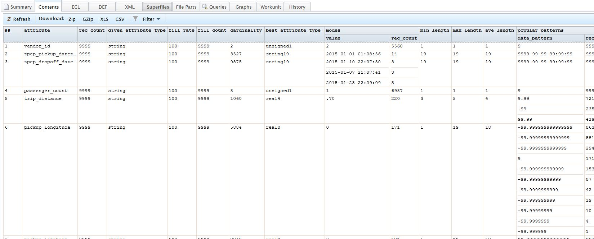
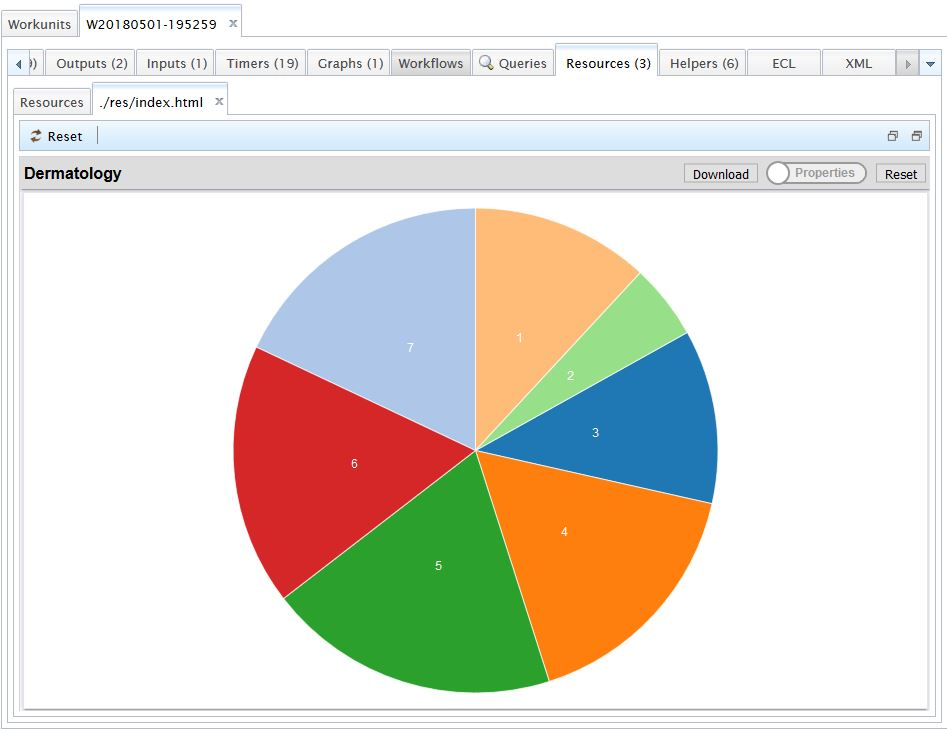
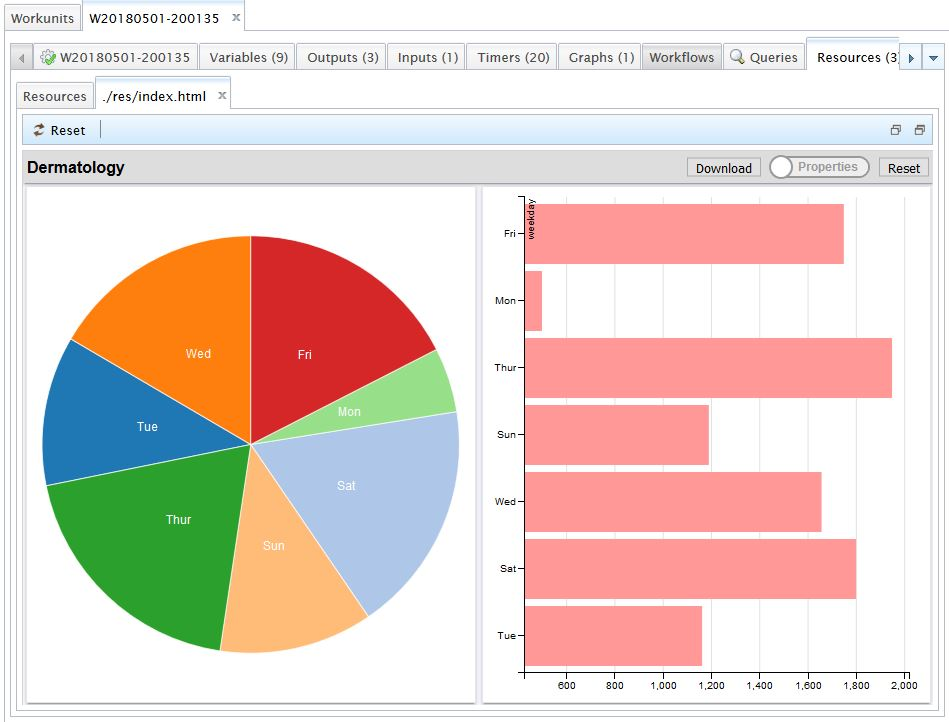

# Summary

Building an ECL application involves 3 steps:

1. Understanding the cluster setup
2. Defining the ECL application project structure and workflow 
3. Programming
    
The programming tasks can be further divided into:

1. Importing the data into Thor
2. Validating the imported data
3. Profile and Learn about the raw data 
4. Clean the raw data 
5. Enrich the data
6. Analyze
7. Visualize
8. Create a training dataset 
9. Build the General Linear Model (GLM) to predict trip volume
10. Export useful data for external consumption

To understand these steps, let us consider a concrete example. We will start with Todd Schneider's excellent project at https://github.com/toddwschneider/nyc-taxi-data. The data contains 1.3 billion taxi and Uber trips originating in New York City. 

The first step in building an ECL application is to build a simplistic approach to quickly consume the data and to complete the first two steps above. To accomplish this, it is best to consider a smaller subset of the Taxi dataset. It will make it easier and faster to accomplish the tasks.

# 1. Understanding the cluster setup

One AWS Instance running Thor, ROXIE, Middleware Services and the Landing Zone. For Thor, we have setup four slave processes. ROXIE is setup as a single process.



# 2. Defining the ECL application project structure and workflow

We will VS Code with the ECL plugin as our IDE for this project.

1. Create a folder called ECL_Tutorial. Open the folder in the VS Code editor. This will act as the projects working directory.
2. Create another folder called Taxi under ECL_Tutorial
3. Create the following files under Taxi:

**Files.ecl**

Contains all the layout definitions for all the files used in the project. 

**01_Data_Import_Job.ecl**

Contains the code to import data from the landing zone into Thor

**02_Data_Import_Validate_Job.ecl**

Contains the code to validate a data import

**03_Data_Patterns_Job.ecl**

Executes the Data Profile report on the raw data to understand the fill rates, cardinality, patterns of characters, optimal field definitions etc.

**04_Clean_Job.ecl**

Job that cleans and converts raw data to a cleaned version

**05_Enrich_Job.ecl**

Adds additional attributes to the cleaned data to make the dataset more valuable to the analysis process

**06_Analyze_Job.ecl**

Perform analysis on the enriched data. trip volumes etc. Also build an attribute dataset that can be used for creating a training dataset to create a machine learning GLM (General Linear Model) to predict trip volumes provided a date in the future. A very simple use case to get you started on using ML techniques within HPCC Systems.

**07_[]_Visualize_Job.ecl**

Quickly visualize analyzed data using the ECL Visualizer bundle

**08_Train_Data_Job.ecl**

Create the training data set containing the pickup_year, pickup_month, pickup_day_of_week and count of trips

**09_GLM_Model_Job.ecl**

Builds the Generalized Linear Model by using the training data of pickup_year, pickup_month, pickup_day_of_week and count of trips

**10_Data_Export_Job.ecl**

Contains the code to export the data from Thor into the landing zone



# 3. Programming

Write ECL code to import raw data, profile, clean, enrich, analyze, visualize, perform machine learning and export data

## 01. Importing the data into Thor

Edit the Files.ecl to add the location of the raw file located on the landing zone:

```ecl
IMPORT STD;

EXPORT Files := MODULE
EXPORT file_scope := '~training-samples';
        EXPORT project_scope := 'taxi';
        EXPORT in_files_scope := 'in';
        EXPORT out_files_scope := 'out';

        /*
            Location of raw file on the landing zone
        */

        EXPORT taxi_lz_file_path := '/var/lib/HPCCSystems/mydropzone/yellow_tripdata_2015-01.csv';

        /*
            Raw file layout and dataset after it is imported into Thor
        */

        EXPORT taxi_raw_file_path := file_scope + '::' + project_scope +
                       '::' + in_files_scope + '::yellow_tripdata.csv';
 END;       

```

NOTE: Substitute {Your Scope Prefix} with a prefix like "~achala_training". If you do not do this, you might override somebody else's files.
A 100,000 record CSV data (sampled randomly across a 1.6 billion recordset) is available on the HPCC Systems playground [landing zone](http://play.hpccsystems.com:8010/?Widget=ECLPlaygroundWidget)

HPCC System services are based on a micro services architecture. For importing a file the **FileSpray** service is used. Since the file **yellow_tripdata_2015-01_10000.csv** is available on the landing zone server and is mapped to the directory /var/lib/HPCCSystems/mydropzone. To import the data, we can write an ECL program with the following action:

Edit the Data_Import_Job.ecl and add the following code:

```ecl
IMPORT STD;
IMPORT Taxi;

STD.File.SprayVariable('{Your Landing Zone IP}',
       Taxi.Files.Landing_Zone.taxi_file_path,
       ,,,,
       'mythor',
       Taxi.Files.Raw.taxi_file_path,
       -1,
       'http://play.hpccsystems.com:8010/FileSpray',,TRUE);

```

NOTE: Substitute {Your Landing Zone IP} with your landing zones IP.

Execute the code using the VS Code debugger and view the results in the ECL Watch output

We could import the file using an user interface, but we want to demonstrate the power of the HPCC Systems micro services. You can invoke these services from any programming language by calling the services end point. In our example, we demonstrate an ECL program invoking the service.

If the program executes correctly, you will see a complete status. Alternatively, if there was an error, you will see an error message.

## 02. Validate if the data has been imported correctly

You can also verify that the file has been correctly sprayed by querying the logical file attributes:

Edit the **Data_Import_Validate_Job.ecl** and add the following code:

```ecl
IMPORT STD;
IMPORT Taxi;

file := Taxi.Files.taxi_raw_file_path;

OUTPUT(STD.File.GetLogicalFileAttribute(file,'recordSize'),NAMED('Record_Size'));
OUTPUT(STD.File.GetLogicalFileAttribute(file,'recordCount'),NAMED('Record_Count'));
OUTPUT(STD.File.GetLogicalFileAttribute(file,'size'),NAMED('File_Size'));
OUTPUT(STD.File.GetLogicalFileAttribute(file,'clusterName'),NAMED('Cluster_Name'));
OUTPUT(STD.File.GetLogicalFileAttribute(file,'directory'),NAMED('Directory'));
OUTPUT(STD.File.GetLogicalFileAttribute(file,'numparts'),NAMED('Data_Parts'));
```

Execute the code using the VS Code debugger and view the results in the ECL Watch output

One of the key features of ECL and HPCC Systems, is the concept of dynamic schema binding. That is, a runtime binding of an ECL Dataset to a layout that matches the format of the file. Let us modify the **Files.ecl** to demonstrate this capability.

Add the layout for the raw input file and then bind it to a dataset. When the taxi_raw_ds is read at runtime, the defined schema (taxi_raw_layout) is bound to it. This is the schema on read characteristic. 

```ecl
EXPORT taxi_raw_layout := RECORD
    STRING  vendor_id;
    STRING  tpep_pickup_datetime;
    STRING  tpep_dropoff_datetime;
    STRING  passenger_count;
    STRING  trip_distance;
    STRING  pickup_longitude;
    STRING  pickup_latitude;
    STRING  rate_code_id;
    STRING  store_and_fwd_flag;
    STRING  dropoff_longitude;
    STRING  dropoff_latitude;
    STRING  payment_type;
    STRING  fare_amount;
    STRING  extra;
    STRING  mta_tax;
    STRING  tip_amount;
    STRING  tolls_amount;
    STRING  improvement_surcharge;
    STRING  total_amount;
END;

EXPORT taxi_raw_ds := DATASET(taxi_raw_file_path, taxi_raw_layout, CSV(HEADING(1)));
    
```

Now, modify the **02_Data_Import_Validate_Job.ecl** to add an OUTPUT step to visually validate the progress using ECL Watch

```ecl
IMPORT STD;
IMPORT Taxi;

file := Taxi.Files.taxi_raw_file_path;

.......
.......

OUTPUT(Taxi.Files.taxi_raw_ds,,NAMED('Raw_Taxi_Data'));
```

## 03. Profile the raw data to validate assumptions

NOTE: To perform this step, you will need the Data Patterns bundle. Use the ecl command line tool to install this bundle globally:

```
ecl bundle install https://github.com/dcamper/DataPatterns.git

```

The profile step is by far the most important step as it helps to validate (or invalidate) assumptions of the incoming raw data. You can easily execute a profile report by using the following code:

Add to Files.ecl

```ecl
/*
    
    EXPORT Data Profile report on the Raw File. Use the report output to understand your data 
    and validate the assumptions you would have made.

*/

EXPORT taxi_data_patterns_raw_file_path := file_scope + '::' + 
        project_scope + '::' + out_files_scope +  '::yellow_tripdata_raw_data_patterns.thor';

```

Modify 03_Data_Patterns_Job.ecl and replace with:

```ecl
IMPORT Taxi;
IMPORT DataPatterns;


IMPORT Taxi;
IMPORT DataPatterns;

rawTaxiData := Taxi.Files.taxi_raw_ds;
OUTPUT(rawTaxiData, NAMED('rawTaxiDataSample'));

rawTaxiProfileResults := DataPatterns.Profile(rawTaxiData, 
             features := 'fill_rate,cardinality,best_ecl_types,lengths,patterns,modes');
OUTPUT(rawTaxiProfileResults,, 
     Taxi.Files.taxi_data_patterns_raw_file_path, OVERWRITE);
```

The content of the output file as viewed in ECL Watch should look like:




## 04. Clean the raw data and convert it to a standard form

So far, we have imported a file into Thor, read it as a Dataset and performed some basic validation. The next step is to clean and optimize the data. In this step, we will perform two operations:

1. Convert the STRING data types to an appropriate type
2. Fix data values that would not make sense

Edit the Files.ecl and add:

```ecl
         /*
            Cleaned file layout and dataset. The cleaned file is created after cleaning the 
            raw file.
        */
    
        EXPORT taxi_clean_file_path := file_scope + '::taxi::out::yellow_tripdata_clean.thor';
        
        EXPORT taxi_clean_layout := RECORD
            UNSIGNED1   vendor_id;
            Std.Date.Date_t    pickup_date;
            Std.Date.Time_t    pickup_time;
            Std.Date.Date_t    dropoff_date;
            Std.Date.Time_t    dropoff_time;
            UNSIGNED1   passenger_count;
            DECIMAL10_2 trip_distance;
            DECIMAL9_6  pickup_longitude;
            DECIMAL9_6  pickup_latitude;
            UNSIGNED1   rate_code_id;
            STRING1     store_and_fwd_flag;
            DECIMAL9_6  dropoff_longitude;
            DECIMAL9_6  dropoff_latitude;
            UNSIGNED1   payment_type;
            DECIMAL8_2  fare_amount;
            DECIMAL8_2  extra;
            DECIMAL8_2  mta_tax;
            DECIMAL8_2  tip_amount;
            DECIMAL8_2  tolls_amount;
            DECIMAL8_2  improvement_surcharge;
            DECIMAL8_2  total_amount;
        END;

        EXPORT taxi_clean_ds := DATASET(taxi_clean_file_path, taxi_clean_layout, THOR);    

```

Edit the **04_Clean_Job.ecl** and add the following code

```ecl
IMPORT STD;
IMPORT Taxi;

Taxi.Files.taxi_clean_layout clean(Taxi.Files.taxi_raw_layout raw) := TRANSFORM
    SELF.vendor_id := (INTEGER)raw.vendor_id;
    SELF.pickup_date  := Std.Date.FromStringToDate(raw.tpep_pickup_datetime[..10], '%Y-%m-%d');
    SELF.pickup_time := Std.Date.FromStringToTime(raw.tpep_pickup_datetime[12..], '%H:%M:%S');
    SELF.dropoff_date  := Std.Date.FromStringToDate(raw.tpep_dropoff_datetime[..10], '%Y-%m-%d');
    SELF.dropoff_time := Std.Date.FromStringToTime(raw.tpep_dropoff_datetime[12..], '%H:%M:%S');
    passenger_count := (UNSIGNED1)raw.passenger_count;
    SELF.passenger_count := IF(passenger_count <= 0, 1, passenger_count);
    SELF.trip_distance := (DECIMAL10_2)raw.trip_distance;
    SELF.pickup_longitude := (DECIMAL9_6)raw.pickup_longitude;
    SELF.pickup_latitude := (DECIMAL9_6)raw.pickup_latitude;
    SELF.rate_code_id := (UNSIGNED1)raw.rate_code_id;
    SELF.store_and_fwd_flag := (STRING1)raw.store_and_fwd_flag;
    SELF.dropoff_longitude := (DECIMAL9_6)raw.dropoff_longitude;
    SELF.dropoff_latitude := (DECIMAL9_6)raw.dropoff_latitude;
    SELF.payment_type := (UNSIGNED1)raw.payment_type;
    SELF.fare_amount := (DECIMAL8_2)raw.fare_amount;
    SELF.extra:= (DECIMAL8_2)raw.extra;
    SELF.mta_tax := (DECIMAL8_2)raw.mta_tax;
    SELF.tip_amount := (DECIMAL8_2)raw.tip_amount;
    SELF.tolls_amount := (DECIMAL8_2)raw.tolls_amount;
    SELF.improvement_surcharge := (DECIMAL8_2)raw.improvement_surcharge;
    SELF.total_amount := (DECIMAL8_2)raw.total_amount;
END;

cleaned := PROJECT(Taxi.Files.taxi_raw_ds, clean(LEFT));  

OUTPUT(cleaned,,Taxi.Files.taxi_clean_file_path, THOR, COMPRESSED, OVERWRITE);
```

We can do a lot more data cleaning but it is best to keep it simple for now. Execute the code and view the output in ECL Watch.

## 05. Enrich the cleaned data

In order to perform granular time based analysis we would need to add calculated time attributes to the cleaned dataset. For example "day of week", "month of year", "hour of day" etc. would be very useful attributes. 

As we have done in the previous steps, let us create a layout and dataset entry for the enriched file in the Files.ecl

```ecl
        /*
            The cleaned file is enriched to add important attributes
        */

        EXPORT taxi_enrich_file_path := file_scope + '::taxi::out::yellow_tripdata_enriched.thor';
        
        EXPORT taxi_enrich_layout := RECORD
            taxi_clean_layout;

            UNSIGNED4 record_id;

            UNSIGNED2 pickup_minutes_after_midnight;            
            UNSIGNED2 dropoff_minutes_after_midnight;

            UNSIGNED2 pickup_time_hour;
            UNSIGNED2 dropoff_time_hour;

            UNSIGNED2 pickup_day_of_week;
            UNSIGNED2 dropoff_day_of_week;
            
            UNSIGNED2 pickup_month_of_year;
            UNSIGNED2 dropoff_month_of_year;

            UNSIGNED2 pickup_year;
            UNSIGNED2 dropoff_year;

            UNSIGNED2 pickup_day_of_month;
            UNSIGNED2 dropoff_day_of_month;
        END;

        EXPORT taxi_enrich_ds := DATASET(taxi_enrich_file_path, taxi_enrich_layout, THOR);
```
Edit the **05_Enrich_Job.ecl** and add the following code

```ecl
IMPORT STD;
IMPORT Taxi;

Taxi.Files.taxi_enrich_layout enrich(Taxi.Files.taxi_clean_layout clean,
     UNSIGNED4 c) := TRANSFORM
    SELF := clean;
    SELF.record_id := c; 
    SELF.pickup_minutes_after_midnight 
         := Std.Date.Hour(SELF.pickup_time) * 60 + Std.Date.Minute(SELF.pickup_time);
    SELF.dropoff_minutes_after_midnight 
         := Std.Date.Hour(SELF.dropoff_time) * 60 + Std.Date.Minute(SELF.dropoff_time);
    SELF.pickup_time_hour := Std.Date.Hour(SELF.pickup_time);
    SELF.dropoff_time_hour := Std.Date.Hour(SELF.dropoff_time);
    SELF.pickup_day_of_week := Std.Date.DayOfWeek(SELF.pickup_date);
    SELF.dropoff_day_of_week := Std.Date.DayOfWeek(SELF.dropoff_date);
    SELF.pickup_month_of_year := Std.Date.Month(SELF.pickup_date);
    SELF.dropoff_month_of_year := Std.Date.Month(SELF.dropoff_date);
    SELF.pickup_year := Std.Date.Year(SELF.pickup_date);
    SELF.dropoff_year := Std.Date.Year(SELF.dropoff_date); 
    SELF.pickup_day_of_month := Std.Date.Day(SELF.pickup_date); 
    SELF.dropoff_day_of_month := Std.Date.Day(SELF.dropoff_date);
END; 

enriched := PROJECT(Taxi.Files.taxi_clean_ds, enrich(LEFT, COUNTER));

OUTPUT(enriched,,Taxi.Files.taxi_enrich_file_path, THOR, COMPRESSED, OVERWRITE);
```

Execute the job and view the workunit results to validate that the files were created successfully. 


## 06. Analysis

Analysis can mean many things to many people. For simplicity, we will create a few aggregated queries. We will use one of these queries as the input to create a training set in step 5. Essentially, the analysis step is where a data scientist steps in to explore the possibility of building a model for predictions. 

Modify the Files.ecl to add an analyzed layout. The file stores the daily trip count. 

```ecl
        /* 
            Create a simple attribute file that records the counts of trips daily
        */
        EXPORT taxi_analyze_file_path := file_scope + '::taxi::out::yellow_tripdata_analyze.thor';
        
        EXPORT taxi_analyze_layout := RECORD
            Std.Date.Date_t    pickup_date;
            UNSIGNED4 cnt;        
        END;

        EXPORT taxi_analyze_ds := DATASET(taxi_analyze_file_path, taxi_analyze_layout, THOR); 
```

Edit the 06_Analyze_Job.ecl

```ecl
        IMPORT STD;
        IMPORT Taxi;

        //count of pickups by a weekday

        cnt_by_weekday_ds:= TABLE(Taxi.Files.taxi_enrich_ds, 
                    {pickup_day_of_week, UNSIGNED4 cnt := COUNT(GROUP)}, 
                    pickup_day_of_week);

        OUTPUT(cnt_by_weekday_ds,,NAMED('count_by_weekday'));

        //**********************DIY**************************

        //What is the avg volume of trips between 7 AM to 10 AM for each week day?

        //What hours of the day do you see the maximimum trips?

        //Daily trips grouped by hour

        //***************************************************

        //count of pickups daily
        cnt_per_day_ds := TABLE(Taxi.Files.taxi_enrich_ds, 
                    {pickup_date, UNSIGNED4 cnt := COUNT(GROUP)}, 
                    pickup_date);


        OUTPUT(cnt_per_day_ds,,Taxi.Files.taxi_analyze_file_path, 
            THOR, COMPRESSED, OVERWRITE);

```
## 07. Visualize analyzed data

Visualization provides the needed abstraction to convey the output of analysis task visually. You can do this in ECL by using the ECL Visualizer bundle.

NOTE: To perform this step, you will need the Visualizer bundle. Use the ecl command line tool to install this bundle globally:

```
ecl bundle install https://github.com/hpcc-systems/Visualizer.git
```

and then modify the 07_A_Visualize_Job.ecl to add

```ecl
IMPORT Taxi;
IMPORT Visualizer;

cnt_by_weekday_ds:= TABLE(Taxi.Files.taxi_enrich_ds, 
             {pickup_day_of_week, UNSIGNED4 cnt := COUNT(GROUP)}, 
             pickup_day_of_week);


OUTPUT(cnt_by_weekday_ds, NAMED('count_by_weekday'));
Visualizer.TwoD.pie('count_by_week_day_pie',, 'count_by_weekday');
``` 

Execute the job, open the ECL workunit output in ECL Watch and navigate to the Resource tab:



This is a fairly boring chart. What if we wanted to see the weekdays instead of the numbers:

modify the 07_B_Visualize_Job.ecl to add

```ecl
IMPORT Taxi;
IMPORT Visualizer;

cnt_by_weekday_ds:= TABLE(Taxi.Files.taxi_enrich_ds, 
             {pickup_day_of_week, UNSIGNED4 cnt := COUNT(GROUP)}, 
             pickup_day_of_week);


cnt_by_weekday_alpha_ds := PROJECT(cnt_by_weekday_ds, TRANSFORM({STRING weekday, UNSIGNED4 cnt}, 
                                           SELF.weekday := CASE(LEFT.pickup_day_of_week, 1 => 'Sun', 2 => 'Mon', 3 => 'Tue', 4 => 'Wed', 5 => 'Thur', 6 => 'Fri', 'Sat'); 
                                           SELF.cnt := LEFT.cnt));

OUTPUT(cnt_by_weekday_alpha_ds, NAMED('count_by_weekday'));
Visualizer.TwoD.pie('count_by_week_day_pie',, 'count_by_weekday');
Visualizer.MultiD.Bar('count_by_week_day_bar',, 'count_by_weekday');
```

Execute the job and you should now see:




## 08. Create training data

Given "pickup day of week", "pickup day of month", "month" and "year", can we predict future trips?  We can certainly try. We will use the Generalized Linear Model (GLM) function in the new ECL ML library in the next step. But first, let us create a training set with the desired independent variables and  dependent variable.

Modify the Files.ecl to add:

```ecl
        /*
            Create a training file to train a GLM for predecting trip counts for a future date
        */

        EXPORT taxi_train_file_path := file_scope + '::taxi::out::yellow_tripdata_train.thor';

        EXPORT taxi_train_layout := RECORD
            unsigned2 pickup_year;
            unsigned2 pickup_month;
            unsigned2 pickup_day_of_month;
            unsigned2 pickup_day_of_week;
            unsigned4 cnt;
        END;

        EXPORT taxi_train_ds := DATASET(taxi_train_file_path, taxi_train_layout, THOR);    

``` 

Edit the 08_Train_Data_Job.ecl to add:

```ecl
        IMPORT STD;
        IMPORT Taxi;

        Taxi.Files.taxi_train_layout train(Taxi.Files.taxi_analyze_layout analyzed) := TRANSFORM
            SELF.pickup_year := Std.Date.Year(analyzed.pickup_date);
            SELF.pickup_month := Std.Date.Month(analyzed.pickup_date);
            SELF.pickup_day_of_month := Std.Date.Day(analyzed.pickup_date);
            SELF.pickup_day_of_week := Std.Date.DayOfWeek(analyzed.pickup_date);
            SELF := analyzed;
        END;  

        trained := PROJECT(Taxi.Files.taxi_analyze_ds, train(LEFT)); 

        OUTPUT(trained,,Taxi.Files.taxi_train_file_path, THOR, COMPRESSED, OVERWRITE);
```

The train code extracts the information from the analyzed dataset we had created in the previous step and creates the independent variables *pickup_year, pickup_month, pickup_day_of_month and pickup_day_of_week* in addition to keeping the *cnt* dependent variable. Execute the code and test the output.

## 09. Create the GLM (General Linear Model) using the training data

Perquisites: The ML_Core and GLB bundles have to preinstalled in your development environment

To install a bundle, execute "ecl bundle install <bundlefile>.ecl --remote"

Now, edit the 09_GLM_Model_Job.ecl

```ecl
IMPORT Taxi;
IMPORT ML_Core;
IMPORT GLM;
IMPORT ML_Core.Types AS Core_Types;  

ds := Taxi.Files.taxi_train_ds;
ML_Core.AppendSeqID(ds, id, ds_seq);      // label the rows with sequence numbers

ML_Core.toField(ds_seq, independent, id, , , 'pickup_day_of_week,pickup_day_of_month,pickup_month,pickup_year');
ML_Core.toField(ds_seq, dependent, id, , , 'cnt');

PoissonSetup := GLM.GLM(independent, dependent, GLM.Family.Poisson); 
PoissonModel := PoissonSetup.GetModel();
PoissonPreds := PoissonSetup.Predict(independent, PoissonModel);
PoissonDeviance := GLM.Deviance_Detail(dependent, PoissonPreds, PoissonModel, GLM.Family.Poisson);

OUTPUT(GLM.ExtractBeta_full(PoissonModel), NAMED('Model')); 
OUTPUT(PoissonPreds, NAMED('Preds'));
OUTPUT(PoissonDeviance, NAMED('Deviance'));    
```


Execute the code and view the outputs. The most interesting output is the Deviance. You will straightaway notice that the predictions are not very accurate (overfit). This is OK for our experiment because our training set was limited (a years worth is not much).


## 10. Data export

If you have interesting work to share with others . User the ECL DESPRAY activity. This will export the data from HPCC back to the landing zone. 

Add to Files.ecl

```ecl
        /*
           Export
        */ 

        EXPORT taxi_analysis_lz_file_path := '/var/lib/HPCCSystems/mydropzone/yellow_tripdata_analysis.csv';  
        EXPORT taxi_analyze_csv_file_path := file_scope + '::taxi::out::yellow_tripdata_analyze.csv';
```

Add to 10_Data_Export.ecl

```ecl
        IMPORT STD;
        IMPORT Taxi;

        OUTPUT(Taxi.Files.taxi_analyze_ds,,Taxi.Files.taxi_analyze_csv_file_path,CSV,OVERWRITE);

        STD.File.DeSpray(Taxi.Files.taxi_analyze_file_path,
            '10.0.0.208',
            Taxi.Files.taxi_analysis_lz_file_path,
            -1,
            'http://play.hpccsystems.com:8010/FileSpray');
```


