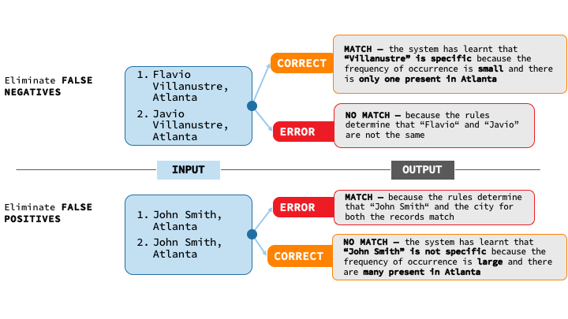
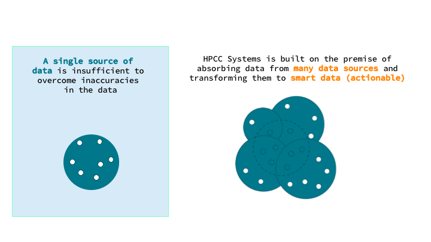
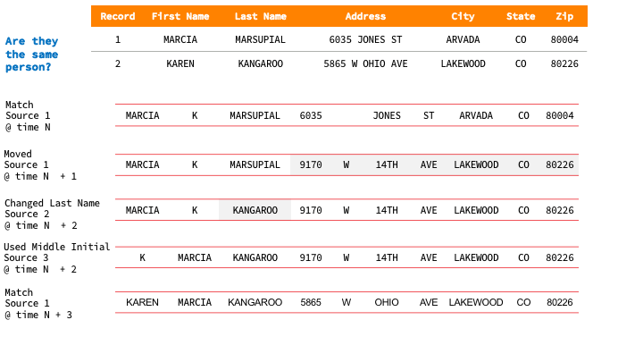
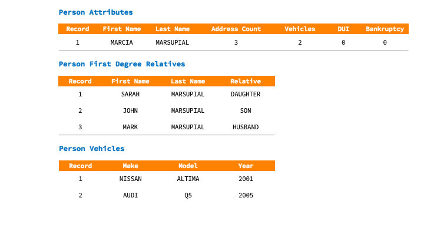
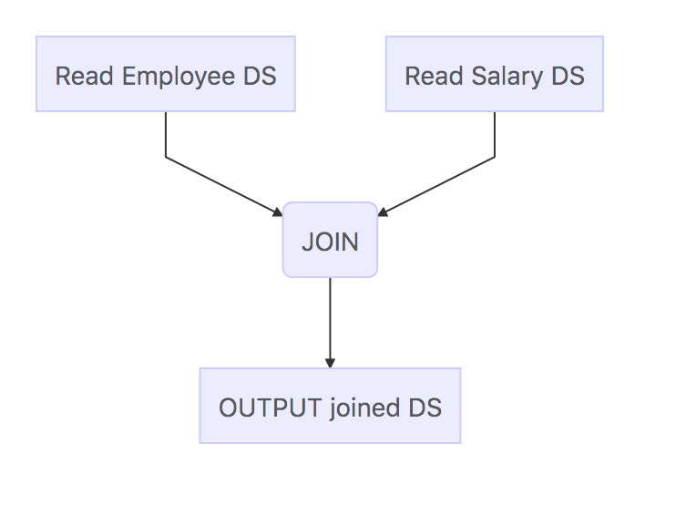
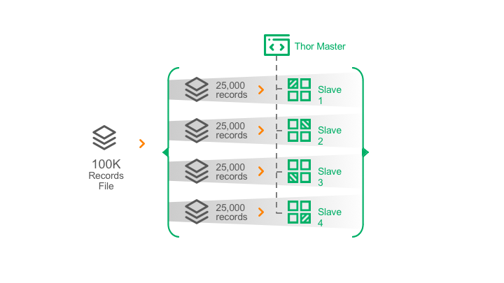
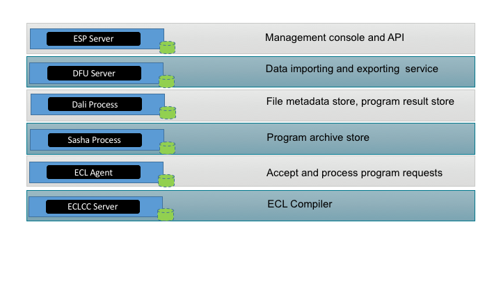
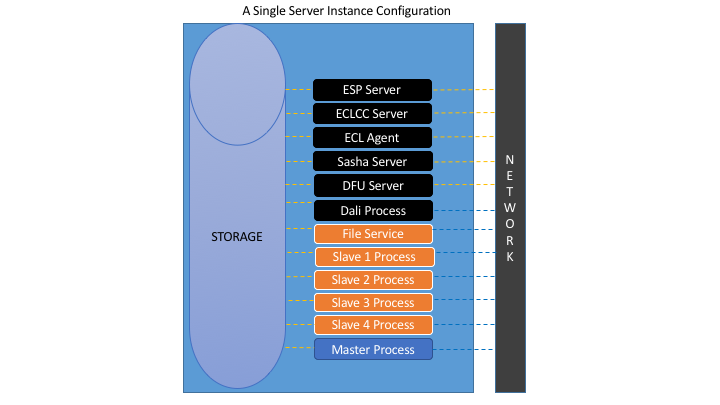
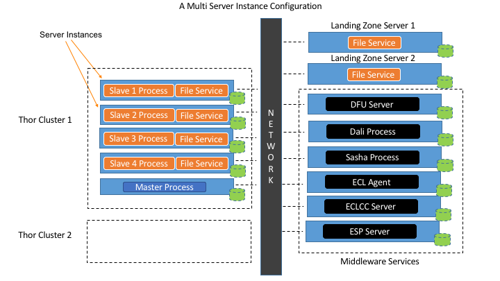
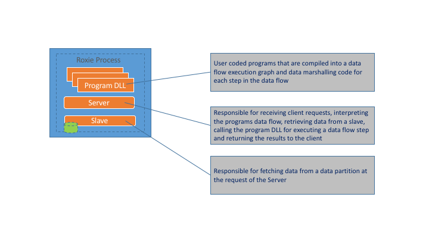

# Summary
HPCC Systems is designed to:

1. Perform data integration
2. Clean data
3. Transform and Enrich data
4. Business Intelligence
5. Machine Learning
6. Data Lake architecture
7. Perform and scale reliably

## Perform data integration

Data integration is the process of acquiring and linking related data. Cars owned by a person, relatives of a person and sales people working on a single account, are all examples of a data integration process. A complex data integration process integrates 1000s of sources of data. 

## Clean data

Dirty data can be categorized into the following:

* Unclean data like _incorrect spelling, incorrect age range etc._
* Misclassified data like _incorrect gender classification (male vs. female)_
* Missing values like _city or state in an address_
* Duplication like _repeating customer names or customer identification_
* Noisy data, where the data used to solve the current problem is recorded
* Data value hidden in complex content like _HTML or Text or Video or Images_

Identifying clean vs. dirty data is dependent on the context and the domain. Making assumptions can lead to significant errors. 

The following are three important steps in data cleaning 

### 1. Learn from data 

Let us consider an example to prove the above statement:


An obvious typo is not significant to stop two records from being matched, and records that matched might not be a match.

Learning from data and the knowledge of the domain is important. A technology that enables a learning based approach to solving data problems is needed. 

### 2. Enhance the accuracy of the data by using many versions

Relying on a single version of truth has many drawbacks. Business logic developed using the single version can be wrong because of inaccurate data. 


The following example shows many versions of the data help accurately identify a person.


### 3. Standardize

Creating a uniform shape of the data is very important to the downstream analytical processes. Constant changes to the shape (structure) of the data make it hard to program the analytic processes that depend on the data. 


## Business Intelligence analysis

Assuming that data has been cleaned, analyzing and providing insight from the data will be the next step.

NOTE: We have a strict distinction between a clean step and a analysis step. From the earlier example, identifying Marcia and Karen as the same person is the responsibility of the clean step. Identifying that this person lived at three addresses is the responsibility of the analysis step. 

The analysis process identifies interesting attributes and entity relations. Attributes are typically aggregation values (count, sum etc.) that can be valuable in building predictive models and end user reporting. 


## Data Lake Architecture

The biggest mistake in a traditional data warehouse is storing data that is deemed significant. Any other data points are dropped. In addition, because of data storage limitations, exactly one version of the data is stored. Therefore, producing a very limited data learning environment.

To be successful at data science, the data scientist has to be given all the data to work with. No data is insignificant. 

To account for Big Data, HPCC Systems is designed to function as Data Lake. Some of the high level characteristics of the HPCC Systems Data Lake:

* Schema on read capability.
* File metadata management. Tracks all the data in the Data Lake.
* Scale to any amount of data.
* Separate compute from storage.  HPCC Systems can scale to many compute clusters.
* High performance by computing close to the data 
* Batch, Streaming and Real-time workloads

## Perform and scale reliably

Hopefully, a case has been made for a Big Data processing system. Learning from historic data, performing sophisticated analysis and keeping all the data around needs significant processing power, reliability and ultimately scalability.  

# The HPCC Systems design 

HPCC Systems design is comprised of three programming components: 

The **ECL program** is the application/code that is executed on Thor and Roxie

**Thor** is a **batch** processing container for ECL programs and data. The Thor executed programs are usually long running (more than a few seconds).

**ROXIE** is a **real-time** services container for ECL programs and data. ROXIE programs execute in sub second times. 

The core design goals for both Thor and Roxie are the same. Both process the data by using a divide and conquer approach. Data is divided into parts and processed in parallel.
[[images/data-parts.png]]

The above is an example of a file with 8 records split into 4 parts with 2 records in each part. Each part is assigned to a process. A 100,000 record file would be split into 4 parts with each part containing 25,000 records.

## ECL
ECL is a [declarative](https://en.wikipedia.org/wiki/Declarative_programming) programming language. The ECL code compiler generates a [data flow graph](https://en.wikipedia.org/wiki/Data_flow_diagram) by interpreting the flow of data within the program. An activity in the graph represents a data operation like a SORT or TRANSFORM. The lines between the activities represent the data that flows between the steps. In addition to the data flow graph, the compiler generates C++ code for each of the activity steps in the graph. The C++ code is compiled to a native DLL. At runtime, Thor or ROXIE interpret the activity graph and execute each step by providing the input to each step, executing the activity and flowing the results of the activity to the next step.   

A simple ECL program:

```ecl
//Read data from employee and salary files
getEmployee := DATASET([{1, 'Mary', 'Peters'}, 
                        {2, 'John', 'Smith'}], 
                        {STRING1 id, STRING25 first, STRING25 last});

getSalary := DATASET([{1, 101000}, {2,99000}], 
                     {STRING1 id, REAL salary});


//Join the two datasets
joinEmployeeAndSalary := JOIN(getEmployee, getSalary, 
                 LEFT.id=RIGHT.id);

//Output the joined datasets
OUTPUT(joinEmployeeAndSalary);
```

[Try the code here](http://play.hpccsystems.com:8010/?Widget=ECLPlaygroundWidget)

...and the ECL programs data flow graph:

 

## Thor

The Thor cluster is based on a master/slave design. Each data partition is processed by a slave process, and a master process manages the slave processes.


### The Middleware

The Middleware are a set of services that manage Thor clusters. They are responsible for: 

* Accepting program requests, coordinating its execution and returning the results.
* Storing the metadata for data stored on the cluster
* Storing execution results
* A management interface to observe the results, start and stop program executions, and manage the cluster components

The Thor middleware components:


A Thor cluster can run on a single compute node or multiple compute node as shown below. 








Production environments should run the middleware services on a separate node (or nodes). This will help in expanding (in the future) the processing capabilities by adding compute nodes to a single cluster or adding multiple clusters. 

ECL programs are executed on Thor by submitting the program code to the ESP service. The following describes the execution flow:


1. The client submits the ECL program to ESP
2. ESP calls Dali to create a workunit entry and embeds the ECL program in the workunit
3. Dali queues a compile job to ECLCC server
4. ECLCC Server de-queues the entry and compiles the ECL program to a DLL
5. After compilation, the ECLCC server updates the workunit entry in Dali by adding the DLL
6. Dali queues the workunit in the Agent queue
7. Agent executor de-queues and creates an ECL Agent to execute the job  
8. If the ECL Agent executes the program, the ECL Agent updates the workunit entry with the results (scenario a). If the ECL Agent determines that it has send it to a Thor cluster, it queues the workunit in the respective Thor's queue (scenario b).
9. The Thor Master de-queues the workunit entry and executes the ECL program
10. The Thor Master updates the Dali workunit entry with the results of the execution

## ROXIE

ROXIE is an API server used to publish real-time data query services. The service can be invoked using SOAP or REST and can be delivered as JSON or XML.


ROXIE based ECL programs can be deployed to ROXIE in a couple of ways:

**Scenario A**

* A-1 ECL Program is submitted for compilation to ESP
* A-2 ESP creates a workunit entry for the ECL Program in Dali
* A-3 Dali queues a compile job to ECLCC Server
* A-4 ECLCC Server de-queues the entry and compiles the ECL program to a DLL
* A-5 After compilation, the ECLCC server updates the workunit entry in Dali by adding the DLL
* A-6 The compiled query is published to a target ROXIE by the client through ESP
* A-7 ESP requests Dali to publish the query
* A-8 Dali publishes the DLL to the target ROXIE
* A-9 The datasets accessed by the ECL program is copied over from the Thor cluster (This can be set to occur when the ROXIE service is requested for the first time)


**Scenario B**

* B-1 ECL Program is compiled to a DLL on the client system and deployed to ROXIE
* B-2 A Package file with the data definitions for the ECL Program is created and copied to ROXIE
* B-3 The datasets accessed by the ECL program is copied over from the Thor cluster 


**Execution**

The deployed ROXIE program creates a wrapper SOAP/REST endpoint. Invoking the end point, initiates the ROXIE Server process to execute the ECL Program by interpreting its data flow graph. The result is immediately returned to the caller.

NOTE: Packages are used to separate data from the code. Therefore, new data can be copied without altering the deployed code.  


A ROXIE cluster can be scaled from a single compute node to 100s. Each compute node runs a single process that consists of three components. The three components share the resources of the process.

The **compiled query service** as a DLL. Hundreds of query services can be deployed to a ROXIE.

The **Server** process accepts client requests, executes the query service and returns the result to the client. One of the important features of the server is to manage the execution of the data flow graph. If it determines a node in a graph requires data, it sends the request to the slave components in the cluster that have the data. The Server communicates to the Slaves via multicast to account for node failures. The Server then collates the data from the slaves and executes the data flow step. Once the entire graph is executed, the Server returns the result to the calling client.

The **Slave** process is mainly responsible for a disk fetch or a single ECL function like a filtered index read. The Slave process receives requests only from a Server process.



