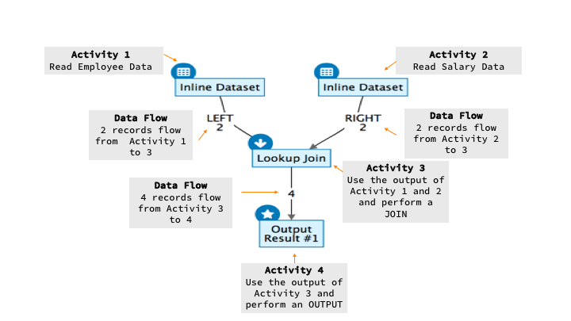
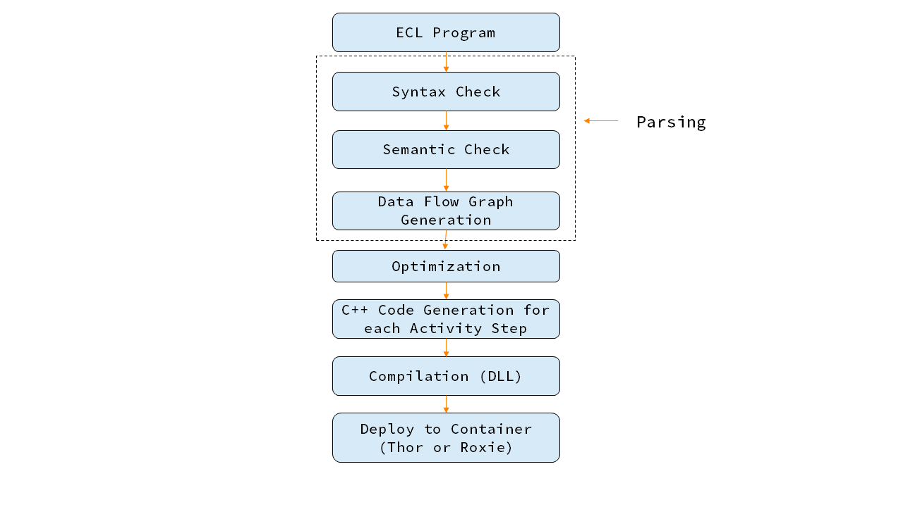
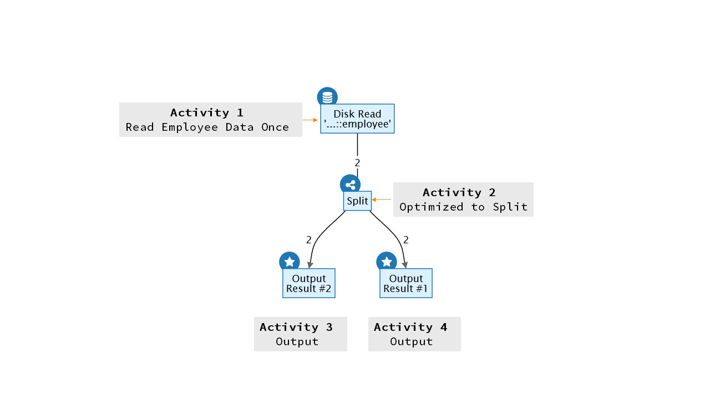
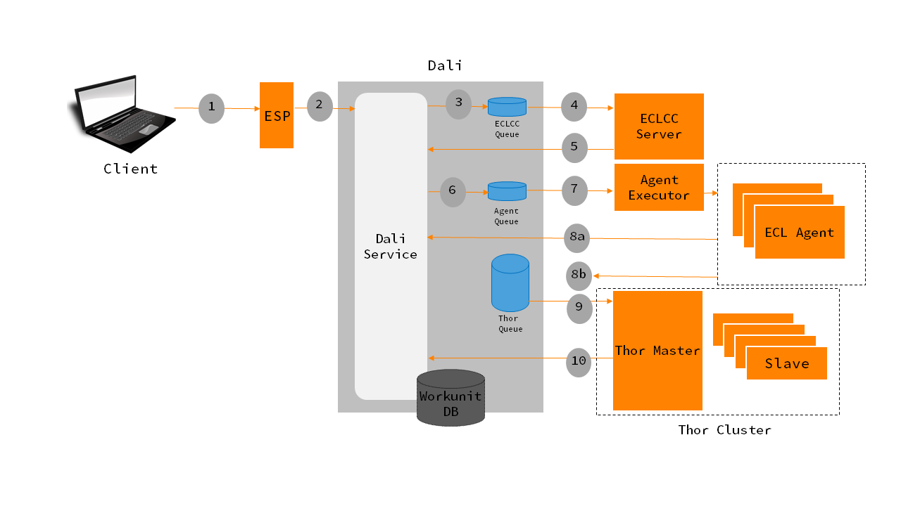
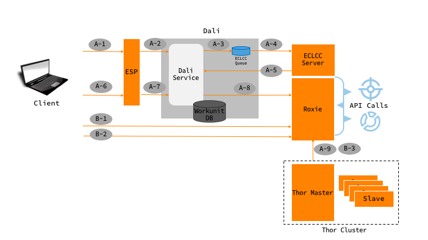

# Summary

There are three programming components in the HPCC Systems design. Thor, Roxie and the ECL program. This page is dedicated to understanding ECL program.

A familiarity with [data flow graphs (diagrams)](https://en.wikipedia.org/wiki/Data_flow_diagram) and [declarative programming](https://en.wikipedia.org/wiki/Declarative_programming) is a prerequisite to understanding ECL programming.

## Data flow graphs (diagrams)
A data flow graph in the context of an ECL program shows the flow of data from one activity to the other. 

Let us consider a simple ECL program that reads data from two datasets and joins them to form a third dataset:

```ecl
//Read data from employee and salary files
getEmployee := DATASET([{1, 'Mary', 'Peters'}, 
                        {2, 'John', 'Smith'}], 
                        {STRING1 id, STRING25 first, STRING25 last});

getSalary := DATASET([{1, 101000}, {2,99000}], 
                     {STRING1 id, REAL salary});


//Join the two datasets
joinEmployeeAndSalary := JOIN(getEmployee, getSalary, 
                 LEFT.id=RIGHT.id);

//Output the joined datasets
OUTPUT(joinEmployeeAndSalary);
```

[Try the code here](http://play.hpccsystems.com:8010/?Widget=ECLPlaygroundWidget)


The data flow graph for the above example is shown below:



NOTE: Representing a programs flow using a data flow graph shows the ECL compiler optimization and parallelization opportunities. For example, reading the employee and salary datasets can be done in parallel.  

## Declarative programming

In declarative programming, programmers write logic without describing the control flow. In other words there are no IF-THEN-ELSE or LOOP or Variable allocation structures in a declarative programming language. The programmer codes the "what" rather then worry about the "how".  

The following example shows how you can interpret an ECL program:


Generally, each step in an ECL program represents an activity in the data flow graph. There are a few exceptions which we will cover in the later sections. 

NOTE: Experts with the knowledge of the problem domain are the best data programmers. ECL is designed to enable such experts by providing a simple programming interface.   

# The ECL Compiler

The following diagram describes the stages of the ECL compiler



## Parsing 

The parsing stage involves creating the data flow graph that is not been optimized. The ECL Compiler performs the following checks during this phase:

### Syntax Check 

In this check the program is validated if it conforms to the syntactic grammar.  

```ecl

getEmployee := DATASET( {1, 'Mary', 'Peters'}, 
                        {2, 'John', 'Smith'}, 
                        {STRING1 id, STRING25 first, STRING25 last});

```

Error at line 2:

	syntax error near "{" : expected CHOOSEN, COUNT, LENGTH, SIZEOF

because the datasets inline records are not wrapped by []. 

The correct syntax would be:


```ecl

getEmployee := DATASET([{1, 'Mary', 'Peters'}, 
                        {2, 'John', 'Smith'}], 
                         {STRING1 id, STRING25 first, STRING25 last});

```

### Semantic Check

In this check the program is validated if it is meaningful. For example:

```ecl
getEmployee := DATASET([{1, 'Mary', 'Peters'}, 
                        {2, 'John', 'Smith'}], 
                        {STRING1 id, STRING25 first, STRING25 last});

//Join the two datasets
joinEmployeeAndSalary := JOIN(getEmployee, getSalary, 
                 LEFT.id=RIGHT.id);
```

The second statement uses the activity getSalary which has not been declared. You should see an error of the form:

Error at line 6:

	Unknown identifier "getSalary"


The correct ECL code would be:

```ecl
//Read data from employee and salary files
getEmployee := DATASET([{1, 'Mary', 'Peters'}, 
                        {2, 'John', 'Smith'}], 
                        {STRING1 id, STRING25 first, STRING25 last});

getSalary := DATASET([{1, 101000}, {2,99000}], 
                     {STRING1 id, REAL salary});


//Join the two datasets
joinEmployeeAndSalary := JOIN(getEmployee, getSalary, 
                 LEFT.id=RIGHT.id);

//Output the results of the join
OUTPUT(joinEmployeeAndSalary);
```

### Data flow graph generation  

This step creates a representation of the data flow in xml (specifically [XGMML](https://en.wikipedia.org/wiki/XGMML).

```xml
    
    <graph>

      <node id="1">

        <graph>
      
            <att name="rootGraph" value="1"/>

            <node id="2" label="Inline Dataset">
                <att name="name" value="getEmployee"/>
            </node>
            
            <node id="3" label="Inline Dataset">
                <att name="name" value="getSalary"/>
            </node>

            <node id="4" label="Lookup Join">
                <att name="name" value="joinEmployeeAndSalary"/>
            </node>

            <node id="5" label="Output">
                <att name="name" value="OUTPUT"/>
            </node>
            
            <edge id="2_0"
                label="LEFT"
                source="2"
                target="4"/>
            
            <edge id="3_0"
                label="RIGHT"
                source="3"
                target="4"/>     

            <edge id="4_0" source="4" target="5"/>      
      
        </graph>

      </node>  

    </graph>

``` 

## Optimization

One of the key functions of the ECL compiler is to introspect a user developed ECL program and perform the optimization. For example, the program might be coded to read the same dataset twice, but the optimizer would optimize it to read it only once. Let us illustrate this with an example:

STEP 1: Create some dummy data on disk

```ecl
getEmployee := DATASET([{1, 'Mary', 'Peters'}, 
                        {2, 'John', 'Smith'}], 
                        {STRING1 id, STRING25 first, STRING25 last});


OUTPUT(getEmployee,,'~training-samples::in::employee', OVERWRITE); 
``` 

STEP 2: Read the same dataset twice and output (NOTE: Target should be Thor)


```
//Read the sample file twice
getEmployee1 := DATASET('~training-samples::in::employee', 
                   {STRING1 id, STRING25 first, STRING25 last}, THOR);

getEmployee2 := DATASET('~training-samples::in::employee', 
                   {STRING1 id, STRING25 first, STRING25 last}, THOR);

//Output the results of each of the reads
OUTPUT(getEmployee1);
OUTPUT(getEmployee2);
```

The optimized graph is shown below:




The generated data flow graph has been optimized by the ECL compiler to read the data only once from the disk even though it is coded to read it twice.

## C++ Code Generation

The data flow graph provides the graph execution engines (Thor or ROXIE) information to navigate and execute the activities. To make an activities execution as efficient as possible, the ECL compiler generates C++ functions that represents the activity. 

## Compilation (DLL)

The combined C++ code of all the activates and the data flow graph in an ECL program is compiled into a dynamic link library (DLL). 

## Deployed to the execution engines

The DLL's are then deployed to either Thor or ROXIE or both.  

# The ECL program deployment and execution


## Execution

A Thor programs execution begins with the Thor Master. The Thor Master interprets the data flow graph and determines which Thor component (master or slave) has to execute the activity. If the Thor Master determines it has to hand off the execution to the Thor Slaves, the Master manages the communication and any data marshalling that is needed with the Slaves. Slaves are capable of executing a subgraph by themselves.   

A ROXIE programs execution begins with the ROXIE Server. The ROXIE Server interprets the data flow graph and executes most of the computational activities. When an activity is dependent on data from the disk, the Server delegates that activities execution to the ROXIE slaves that are responsible for the data. It is worth noting that in most cases, a single files data is distributed across many ROXIE slaves.


## Thor ECL program deployment and execution workflow:




1. The client submits the ECL program to ESP
2. ESP calls Dali to create a workunit entry and embeds the ECL program in the workunit
3. Dali queues a compile job to ECLCC server
4. ECLCC Server de-queues the entry and compiles the ECL program to a DLL
5. After compilation, the ECLCC server updates the workunit entry in Dali by adding the DLL
6. Dali queues the workunit in the Agent queue
7. Agent executor de-queues and creates an ECL Agent to execute the job  
8. If the ECL Agent executes the program, the ECL Agent updates the workunit entry with the results (scenario a). If the ECL Agent determines that it has send it to a Thor cluster, it queues the workunit in the respective Thor's queue (scenario b).
9. The Thor Master de-queues the workunit entry and executes the ECL program
10. The Thor Master updates the Dali workunit entry with the results of the execution

## ROXIE ECL program deployment and execution workflow:



ROXIE based ECL programs can be deployed to ROXIE in a couple of ways:

**Scenario A**

* A-1 ECL Program is submitted for compilation to ESP
* A-2 ESP creates a workunit entry for the ECL Program in Dali
* A-3 Dali queues a compile job to ECLCC Server
* A-4 ECLCC Server de-queues the entry and compiles the ECL program to a DLL
* A-5 After compilation, the ECLCC server updates the workunit entry in Dali by adding the DLL
* A-6 The compiled query is published to a target roxie by the client through ESP
* A-7 ESP requests Dali to publish the query
* A-8 Dali publishes the DLL to the target ROXIE
* A-9 The datasets accessed by the ECL program is copied over from the Thor cluster (This can be set to occur when the ROXIE service is requested for the first time)


**Scenario B**

* B-1 ECL Program is compiled to a DLL on the client system and deployed to ROXIE
* B-2 A Package file with the data definitions for the ECL Program is created and copied to ROXIE
* B-3 The datasets accessed by the ECL program is copied over from the Thor cluster 


**Execution**

The deployed ROXIE program creates a wrapper SOAP/REST endpoint. Invoking the end point, initiates the ROXIE Server process to execute the ECL Program by interpreting its data flow graph. The result is immediately returned to the caller.

