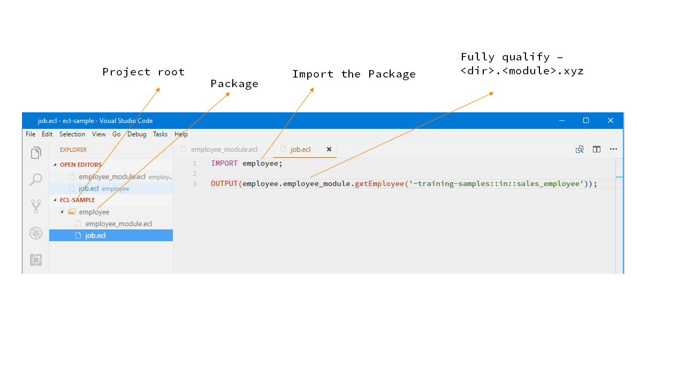

# Summary

ECL was invented with the purpose of being a concise programming language. A single line of ECL can be very powerful. An example:

```ecl
getEmployee := DATASET([{1, 'Mary', 'Peters'}, 
                        {2, 'John', 'Smith'}], 
                        {STRING1 id, STRING25 first, STRING25 last});

getSalary := DATASET([{1, 101000}, {2,99000}], 
                     {STRING1 id, REAL salary});


//Join the two datasets
joinEmployeeAndSalary := JOIN(getEmployee, getSalary, 
                 LEFT.id=RIGHT.id);

//Output the results of the join
OUTPUT(joinEmployeeAndSalary);
```

this is the same program that is used in the [ECL Introduction](ECL_Introduction.md) page. The same code can be written in a single line:


```ecl
OUTPUT(

  JOIN(  
    
    DATASET([{1, 'Mary', 'Peters'}, 
                        {2, 'John', 'Smith'}], 
                        {STRING1 id, STRING25 first, STRING25 last}),

    DATASET([{1, 101000}, {2,99000}], 
                     {STRING1 id, REAL salary}),

    LEFT.id=RIGHT.id                  

  ) 

);

```
[Try the code here](http://play.hpccsystems.com:8010/?Widget=ECLPlaygroundWidget)

Notice that the generated data flow graph for both the programs remain exactly the same. Hence, confirming that the ECL programmer codes the "what" and the "how" is decided by the ECL compiler.

While writing concise code is great for developing small programs, it is not an option for large programs. Readability and code reuse will be affected.  The following section is an introduction to the ECL programming structures.

# ECL Programming Structures

## An Activity (aka Action)

As shown in the previous example, an ECL program can be one statement. OUTPUT is a function that has an intent of producing a result. Such functions are called as Actions in ECL. If an ECL program was to be compiled and executed on Thor, it will need at least one Action contained in it. 

```ecl
OUTPUT('Hello World');
```

or

```ecl
JOIN(  
    
    DATASET([{1, 'Mary', 'Peters'}, 
                        {2, 'John', 'Smith'}], 
                        {STRING1 id, STRING25 first, STRING25 last}),

    DATASET([{1, 101000}, {2,99000}], 
                     {STRING1 id, REAL salary}),

    LEFT.id=RIGHT.id                  

); 
```

Grammar:

```
<activity>;
```


## An Activity Declaration 

The other functions like JOIN, DATASET can also be treated as an OUTPUT if they are declared without a "label := ". If they are accompanied by a label, they are treated as a declaration of an activity.

```ecl
getEmployee := DATASET([{1, 'Mary', 'Peters'}, 
                        {2, 'John', 'Smith'}], 
                        {STRING1 id, STRING25 first, STRING25 last});
```

"getEmployee" is a label declaring an activity to read the employee data. Note that it does not read the data until an Action uses it.


Grammar:  

```
<label> := <activity>;
```


## A Record Declaration (aka Dynamic Schema Binding)

A runtime time binding of a Dataset to an input file layout

Consider the following ECL program example:

```ecl
softwareEmployees := DATASET([{1, 'Mary', 'Peters'}, 
                              {2, 'John', 'Smith'}], 
                                {STRING1 id, STRING25 first, STRING25 last});

salesEmployees    := DATASET([{1, 'Sam', 'Knowels'}, 
                              {2, 'Rodger', 'Smith'}], 
                                {STRING1 id, STRING25 first, STRING25 last});

OUTPUT(softwareEmployees);
OUTPUT(salesEmployees);
```

Grammar:  

```
<label> := RECORD
   <data_type>  <label>;
   <data_type>  <label>;
END;
```

In the example, we are reading two datasets that are similar in structure. One of the parameters of  DATASET ECL function accepts the structure definition. In this case it is:  {STRING1 id, STRING25 first, STRING25 last}. As you have already noticed, the structure definition is repeated across both the statements. To avoid repeating structure definitions, it can be declared once and reused using a RECORD declaration:

```ecl
employee_layout := RECORD
  STRING1 id;
  STRING25 first;
  STRING25 last;
END;

softwareEmployees := DATASET([{1, 'Mary', 'Peters'}, 
                              {2, 'John', 'Smith'}], 
                                employee_layout);

salesEmployees    := DATASET([{1, 'Sam', 'Knowels'}, 
                              {2, 'Rodger', 'Smith'}], 
                                employee_layout);

OUTPUT(softwareEmployees);
OUTPUT(salesEmployees);
```

## A Function Declaration

All the activities such as DATASET, JOIN and OUTPUT that we have used thus far are all ECL functions. ECL functions provide an abstraction for reusable code. Consider an example:

First let us populate a couple of files:

```ecl
employee_layout := RECORD
  STRING1 id;
  STRING25 first;
  STRING25 last;
END;

softwareEmployees := DATASET([{1, 'Mary', 'Peters'}, 
                              {2, 'John', 'Smith'}], 
                                employee_layout);

salesEmployees    := DATASET([{1, 'Sam', 'Knowels'}, 
                              {2, 'Rodger', 'Smith'}], 
                                employee_layout);

OUTPUT(softwareEmployees,,'~training-samples::in::software_employee', OVERWRITE); 
OUTPUT(salesEmployees,,'~training-samples::in::sales_employee', OVERWRITE); 
```

Since both files share the same structure, it would make sense to abstract the read to a common function: 

```ecl
DATASET getEmployee (STRING filePath) := FUNCTION 
  RETURN DATASET(filePath,  {STRING1 id, STRING25 first, STRING25 last}, THOR);
END;

OUTPUT(getEmployee('~training-samples::in::software_employee'));
OUTPUT(getEmployee('~training-samples::in::sales_employee'));
```

## A MODULE

A Module is an abstraction for combining related code. For example, if we wanted to combine Employee related declarations, we would create a module:

```
EXPORT employee_module := MODULE
    EXPORT employee_layout := RECORD
        STRING1 id;
        STRING25 first;
        STRING25 last;
    END;
    
    EXPORT DATASET getEmployee (STRING filePath) := FUNCTION 
        RETURN DATASET(filePath,  Employee_Layout, THOR);
    END;
END;
```

Grammar:

```
<label> := MODULE

END;
```

## An ECL File

An ECL file is a higher level abstraction than a Module and is specifically represented as a physical file. The ECL file can contain MODULE code, FUNCTION code or straight ECL activity declarations. A file that is an executable should always contain an ECL Activity like an OUTPUT.

An example Job.ecl file can be:

```ecl
EXPORT employee_module := MODULE
    EXPORT Employee_Layout := RECORD
        STRING1 id;
        STRING25 first;
        STRING25 last;
    END;
    
    EXPORT DATASET getEmployee (STRING filePath) := FUNCTION 
        RETURN DATASET(filePath,  Employee_Layout, THOR);
    END;
END;

OUTPUT(employee_module.getEmployee('~training-samples::in::sales_employee'));
```

## Multiple files

You can separate program code by logically by using multiple files. For example, we can have:

**employee_module.ecl**

```ecl
EXPORT employee_module := MODULE
    EXPORT employee_layout := RECORD
        STRING1 id;
        STRING25 first;
        STRING25 last;
    END;
    
    EXPORT DATASET getEmployee (STRING filePath) := FUNCTION 
        RETURN DATASET(filePath,  employee_layout, THOR);
    END;
END;
```

and **job.ecl**

```ecl
OUTPUT($.employee_module.getEmployee('~training-samples::in::sales_employee'));
```

This assumes that both files are in the same directory


## Importing files

One file can reference another by using the **IMPORT** ECL directive. To be able to effectively use the IMPORT directive, we recommend that you follow the following directory (package) layout:

```
<root-project-directory>
----------<domain-specific-directory>
----------<....>
```

A real example in VSCode is shown here:




